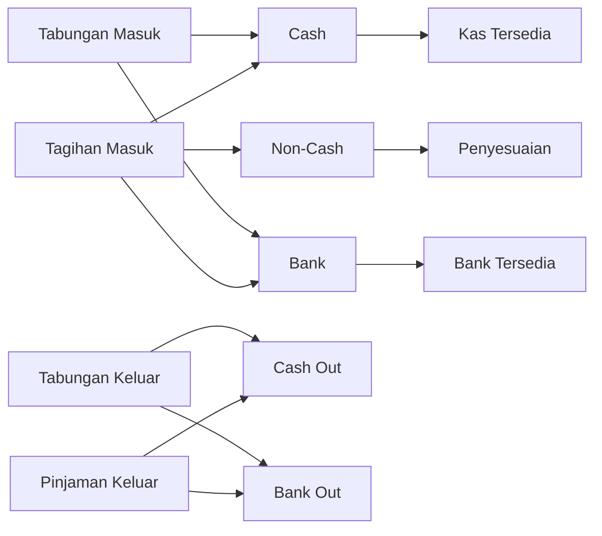
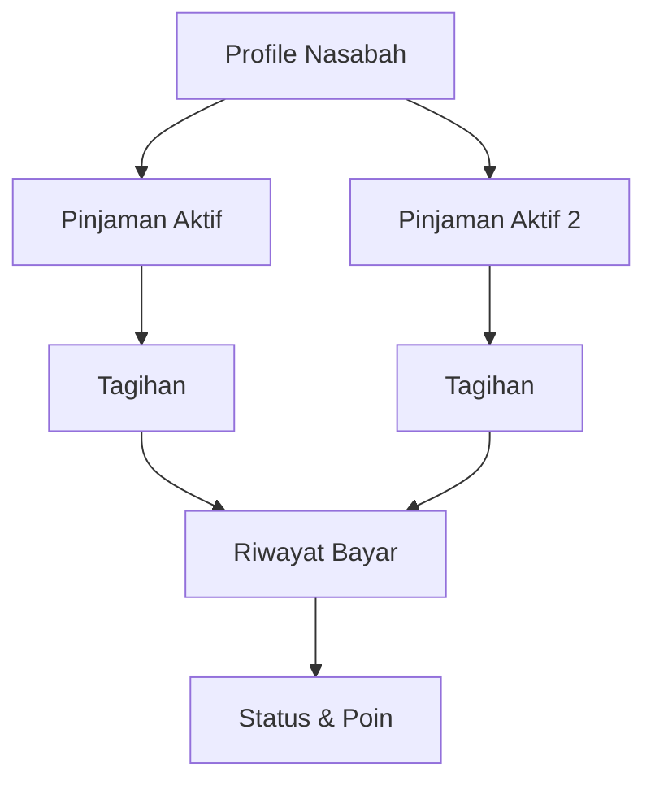
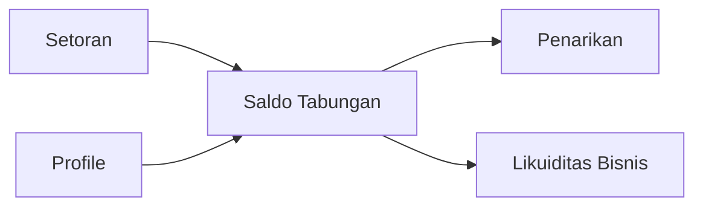
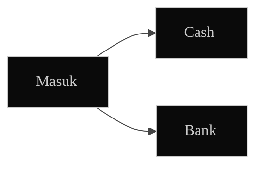
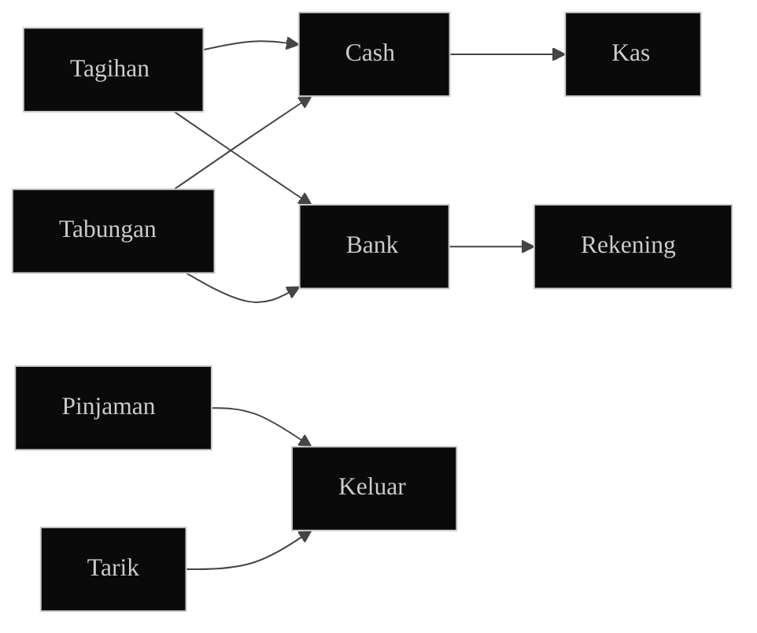
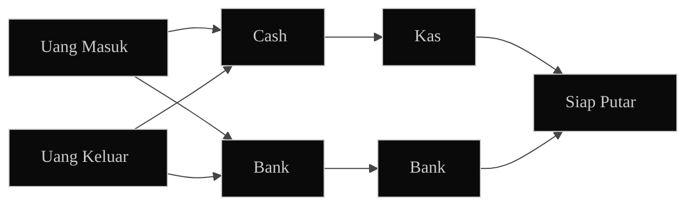
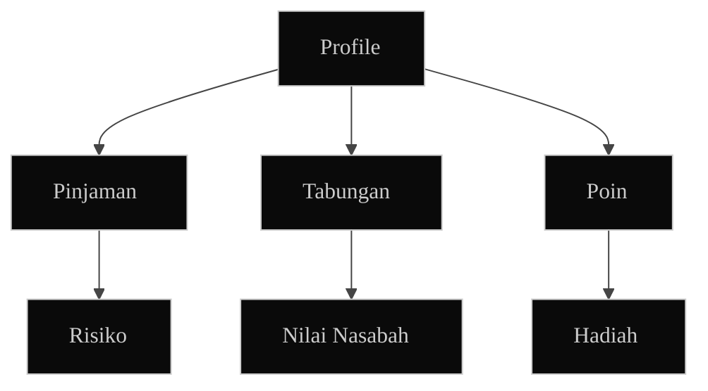

# UI Spec Dashboard Admin Parlin Finance

Status: Production UI Blueprint  
Tanggal: 26 Juni 2026  
Target: Web admin `pffinance`  
Basis visual: admin panel dark UI yang sudah ada, dibuat lebih rapi, lebih padat, dan lebih siap produksi  
Referensi visual: gabungan `DESIGN-vercel-com.md`, `DESIGN-vercel-com (1).md`, dan `DESIGN-vercel-com (2).md`

## 1. Arah UI

Dashboard admin harus terasa seperti alat kerja finansial, bukan halaman edukasi.

Karakter UI:

- tenang
- padat
- mudah discan
- minim teks penjelasan
- angka penting selalu terlihat
- semua angka bisa ditelusuri ke detail

Yang tidak boleh tampil di UI produksi:

- teks guide panjang
- istilah teknis database
- paragraf penjelasan fitur
- copy yang terasa seperti dokumentasi
- kartu besar yang hanya berisi deskripsi

## 2. Riset Singkat

Dashboard yang baik memberi `at-a-glance view` untuk tujuan tertentu, lalu menyediakan interaksi untuk melihat detail ketika dibutuhkan. Dalam desain dashboard modern, pola yang paling kuat adalah menggabungkan KPI ringkas, tren, filter, dan drill-down detail.

Insight yang dipakai:

- dashboard harus dimulai dari tujuan bisnis, bukan dari daftar tabel
- informasi utama ditempatkan di area paling awal dibaca
- chart dipakai untuk tren dan komparasi, bukan dekorasi
- tabel dipakai untuk tindakan dan audit
- interaksi utama adalah filter, drill-down, dan segmentasi
- terlalu banyak teks membuat dashboard lambat dipahami

Sumber riset:

- Dashboard sebagai tampilan ringkas dan interaktif untuk proses tertentu: https://en.wikipedia.org/wiki/Dashboard_(computing)
- Dashboard design patterns dan pola umum dashboard produksi: https://arxiv.org/abs/2205.00757
- User-centered dashboard design menekankan data quality, ekspektasi pengguna, dan kebutuhan yang berubah: https://arxiv.org/abs/2209.06363
- Iterasi dashboard BI yang baik bergerak dari visualisasi ke decision support: https://arxiv.org/abs/2510.27572

## 3. UI Principles

1. One screen, one decision.
2. Angka besar dulu, detail setelahnya.
3. Cash, bank, dan non-cash harus punya warna dan label berbeda.
4. Tabel utama harus actionable.
5. Diagram harus menjelaskan aliran uang, bukan menghias halaman.
6. Copy UI pendek, maksimal 1 baris untuk label.
7. Empty state cukup 1 kalimat.
8. Error state langsung menyebut masalah dan tombol retry.

## 3.1 Vercel Reference Merge

Dashboard memakai bahasa visual Vercel, tetapi disesuaikan untuk bisnis simpan pinjam.

Hal yang diambil dari referensi:

- canvas hitam penuh
- surface gelap tipis
- border 1px yang halus
- typography Geist
- layout compact
- tombol kecil dan tegas
- radius 6px sebagai default
- warna dipakai sebagai status, bukan dekorasi

Hal yang tidak diambil:

- hero marketing
- teks promosi
- banner besar
- ilustrasi dekoratif
- kartu besar tanpa aksi

Rasa akhir UI:

- seperti control panel finansial
- seperti Vercel dashboard
- tetap mudah dipakai pemilik usaha
- lebih fokus ke angka, status, dan tindakan

## 4. Struktur Navigasi

Sidebar tetap sederhana:

- Overview
- Cashflow
- Pinjaman
- Tabungan
- Nasabah
- Poin & Hadiah
- Risiko

Tab lama yang tidak langsung membantu keputusan bisnis bisa disembunyikan atau digabung.

## 5. Layout Global

Desktop layout:

- sidebar kiri tetap
- header atas berisi judul halaman, range tanggal, refresh, dan status sync
- content utama memakai grid 12 kolom
- tinggi kartu konsisten
- radius kartu default 6px
- tabel memakai density compact
- max-width content 1440px di layar besar
- page background selalu `#000000`

Mobile layout:

- KPI jadi horizontal scroll
- tabel berubah menjadi list compact
- chart tetap sederhana

Shell layout ala Vercel:

- sidebar gelap dengan active item surface `#1f1f1f`
- header atas tipis dengan border bawah
- content area memakai padding 24px
- section memakai judul pendek di kiri dan action di kanan
- filter ditempatkan di header section, bukan menjadi card terpisah
- tidak ada hero besar di dashboard admin

## 6. Overview Page

Tujuan: melihat kesehatan bisnis dalam 10 detik.

Urutan layar:

1. Top KPI strip
2. Cashflow split
3. Collection performance
4. Priority customers
5. Recent money movement

KPI utama:

- Kas
- Bank
- Tagihan Masuk
- Pinjaman Keluar
- Outstanding
- Dana Siap Putar

UI copy:

- `Kas`
- `Bank`
- `Tagihan`
- `Keluar`
- `Outstanding`
- `Siap Putar`

Tidak perlu teks seperti:

- "Berikut adalah ringkasan..."
- "Gunakan halaman ini untuk..."
- "Data dihitung berdasarkan..."

## 7. Cashflow Page

Tujuan: melihat uang masuk dan keluar dengan sumber dana jelas.

Kartu utama:

- Cash In
- Cash Out
- Bank In
- Bank Out
- Non-Cash
- Net Movement

Diagram utama:



Warna diagram:

- Cash: hijau
- Bank: biru
- Outflow: merah
- Non-cash: abu

Tabel bawah:

- Waktu
- Nama
- Jenis
- Sumber
- Nominal
- Status

## 8. Pinjaman Page

Tujuan: melihat portofolio pinjaman dan prioritas tagih.

KPI:

- Aktif
- Target Hari Ini
- Tertagih
- Belum Bayar
- Bolong
- Sisa Tagihan

Tabel utama:

- Nasabah
- Pinjaman
- Lokasi
- Setoran
- Tertagih
- Sisa
- Bolong
- Poin
- Status

Row behavior:

- klik row membuka drawer detail
- badge untuk `Harian` atau `Mingguan`
- status merah untuk risiko
- status hijau untuk sehat

Diagram pinjaman:



## 9. Tabungan Page

Tujuan: melihat tabungan sebagai bagian dari likuiditas.

KPI:

- Akun Aktif
- Saldo Total
- Masuk
- Keluar
- Net

Tabel:

- Nasabah
- Akun
- Saldo
- Masuk
- Keluar
- Transaksi Terakhir
- Status

Diagram tabungan:



## 10. Nasabah Page

Tujuan: satu tempat untuk melihat nilai bisnis tiap nasabah.

KPI row per nasabah:

- pinjaman aktif
- sisa tagihan
- saldo tabungan
- poin profile
- poin pinjaman aktif
- level

Segment:

- Prioritas Tagih
- Poin Tertinggi
- Tabungan Tertinggi
- Outstanding Tertinggi
- Risiko

Tabel:

- Nama
- Lokasi
- Pinjaman
- Tabungan
- Outstanding
- Poin
- Level
- Risiko

## 11. Poin & Hadiah Page

Tujuan: membuat loyalitas mudah dipantau.

KPI:

- Poin Beredar
- Hadiah Aktif
- Redeem Bulan Ini
- Nasabah Level 3

Tampilan:

- leaderboard
- reward catalog
- activity feed
- filter point source

Copy UI:

- `Profile Points`
- `Loan Points`
- `Reward`
- `Redeem`

## 12. Risiko Page

Tujuan: daftar tindakan harian.

Cards:

- Telat Hari Ini
- Bolong Terbanyak
- Jatuh Tempo Mingguan
- Setoran Turun
- Transaksi Diedit

Tabel:

- Nasabah
- Pinjaman
- Masalah
- Dampak
- Terakhir Bayar
- Aksi

Label risiko:

- `Aman`
- `Pantau`
- `Prioritas`
- `Kritis`

## 13. Design Tokens

Gunakan token gabungan dari referensi Vercel. Jangan membuat palette baru kecuali ada alasan bisnis yang jelas.

Core colors:

- App background: `#000000`
- Surface: `#0a0a0a`
- Surface raised: `#1f1f1f`
- Surface hover: `#292929`
- Text primary: `#ededed`
- Text secondary: `#a1a1a1`
- Text disabled: `#454545`
- Border subtle: `rgba(255,255,255,0.145)`
- Border dark: `#1f1f1f`

Brand and status colors:

- Primary action: `#0072f5`
- Primary hover: `#0062d1`
- Focus/link: `#52a8ff`
- Cash/success: `#45a557`
- Bank/info: `#0072f5`
- Warning/reward: `#ff990a`
- Danger/outflow/risk: `#ff6166`
- Neutral/non-cash: `#a1a1a1`

Semantic use:

- Cash masuk memakai green.
- Bank masuk memakai blue.
- Semua uang keluar memakai red.
- Reward dan hadiah memakai amber.
- Risiko berat memakai red.
- Non-cash memakai neutral dan tidak boleh dicampur ke cash/bank.

Typography:

- Font utama: `Geist`, fallback `Inter`, `system-ui`, sans-serif.
- Page title: 20-24px, weight 500-600, letter spacing negatif tipis.
- Section title: 16px, weight 500.
- Card label: 11-12px, uppercase ringan, warna secondary.
- Body/table: 13-14px.
- Angka KPI: 24-32px, weight 600, tabular numbers.
- Amount table: 14-15px, weight 600, tabular numbers.

Spacing:

- Base unit: 8px.
- Page padding desktop: 24px.
- Grid gap: 16px.
- Card padding: 16px atau 24px untuk summary besar.
- Header height: 56-64px.
- Table row height: 44-52px.
- Filter gap: 8px.

Radius:

- Card: 6px.
- Button: 6px.
- Input: 6px.
- Badge: 999px untuk pill, 6px untuk label kotak.
- Drawer/modal: 10px.

Elevation:

- Default card: `0 0 0 1px rgba(255,255,255,0.145)`.
- Raised card: default card + `0 1px 2px rgba(0,0,0,0.16)`.
- Jangan pakai shadow tebal atau glow besar.

Component rules:

- Button utama compact, tinggi 32-36px.
- Button secondary memakai surface raised, bukan warna solid terang.
- Search/filter memakai border halus, background `#0a0a0a`.
- Badge harus pendek: `Cash`, `Bank`, `Non-Cash`, `Harian`, `Mingguan`, `Aman`, `Risiko`.
- Card KPI tidak boleh berisi paragraf.
- Tabel harus compact dan bisa discan dari kiri ke kanan.
- Chart memakai garis tipis, grid minimal, legend pendek.

CSS variable baseline:

```css
:root {
  --pf-bg: #000000;
  --pf-surface: #0a0a0a;
  --pf-surface-raised: #1f1f1f;
  --pf-surface-hover: #292929;
  --pf-text: #ededed;
  --pf-muted: #a1a1a1;
  --pf-disabled: #454545;
  --pf-border: rgba(255, 255, 255, 0.145);
  --pf-primary: #0072f5;
  --pf-primary-hover: #0062d1;
  --pf-focus: #52a8ff;
  --pf-cash: #45a557;
  --pf-bank: #0072f5;
  --pf-warning: #ff990a;
  --pf-danger: #ff6166;
  --pf-radius: 6px;
}
```

## 14. UI Copy Rules

Gunakan label pendek:

- `Masuk`
- `Keluar`
- `Cash`
- `Bank`
- `Non-Cash`
- `Net`
- `Sisa`
- `Bolong`
- `Poin`
- `Hadiah`

Hindari:

- kalimat penjelasan panjang
- istilah database
- "berdasarkan transaksi..."
- "gunakan fitur ini..."
- teks yang hanya menjelaskan UI

## 15. Interaction Rules

Semua KPI utama bisa diklik.

Click behavior:

- KPI cash membuka cashflow detail
- KPI tagihan membuka repayment list
- KPI outstanding membuka pinjaman aktif
- KPI risiko membuka risk page
- nama nasabah membuka drawer profile

Filter global:

- Hari ini
- 7 Hari
- 30 Hari
- Bulan Ini
- Custom

Filter domain:

- Cash
- Bank
- Non-Cash
- Pinjaman
- Tabungan
- Lokasi
- Status

## 16. Diagram UI yang Direkomendasikan

Diagram harus dipakai maksimal 1 per halaman utama.

Style:

- node pendek
- tidak lebih dari 8 node
- arah kiri ke kanan untuk aliran uang
- arah atas ke bawah untuk struktur data
- warna sesuai domain
- background mengikuti card `#0a0a0a`
- node memakai border `rgba(255,255,255,0.145)`
- label node maksimal 2 kata
- garis tipis, tidak memakai panah tebal
- hindari diagram yang terlihat seperti dokumentasi database

Mermaid theme dasar:



Diagram cashflow production:



Diagram overview:



Diagram nasabah:



## 17. Production Readiness Checklist

- tidak ada teks guide panjang di layar
- semua KPI punya loading state
- semua KPI punya empty state
- semua KPI bisa drill down
- semua chart punya legend jelas
- cash dan bank tidak dicampur
- non-cash selalu dipisah
- tabel bisa search dan filter
- angka besar tidak overflow
- responsive desktop dan tablet
- error Supabase tampil manusiawi
- tombol refresh tersedia
- tanggal range selalu terlihat

## 18. Prioritas Build

Urutan build:

1. Overview production-ready
2. Cashflow cockpit
3. Pinjaman portfolio
4. Nasabah intelligence
5. Tabungan portfolio
6. Poin & hadiah
7. Risiko

## 19. Keputusan Final UI

Dashboard admin Parlin Finance harus tampil seperti alat kerja pemilik usaha.

Bukan:

- halaman promosi
- halaman tutorial
- laporan teknis

Tetapi:

- pusat kontrol cashflow
- pusat prioritas nasabah
- pusat risiko
- pusat loyalitas
- alat membaca apakah bisnis bergerak sehat dan menguntungkan
